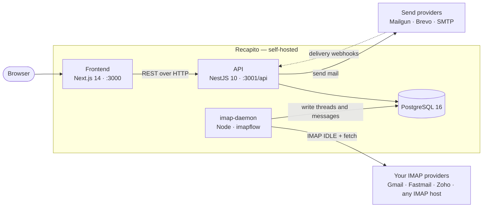

# Recapito

> A self-hosted unified inbox. Connect the IMAP mailboxes you already have, read them all in one threaded interface, and send through Mailgun, Brevo, or your own SMTP server.

[](LICENSE)
[](https://github.com/iampopye/recapito/actions/workflows/ci.yml)
[](CONTRIBUTING.md)

<!--
  The CI badge resolves once .github/workflows/ci.yml exists on the default
  branch. Until then GitHub renders it as "no status". If the workflow lands
  under a different filename, update the badge URL to match.
-->

Recapito pulls mail from any number of IMAP mailboxes into a single threaded inbox, and sends replies back out through Mailgun, Brevo, or plain SMTP. It is a complete application — a NestJS API, a Next.js web client, an IMAP sync daemon, and a Postgres database — packaged as a Docker Compose stack you run yourself. It is built for people and small teams who handle mail across several addresses (support, sales, freelance work) and would rather not hand that mail to a third-party SaaS inbox.

"Recapito" is Italian for *delivery* — and, as a noun, for the contact details you give someone so they can reach you. Pronounced **reh-ka-PEE-toh**.

## What Recapito is, and what it is not

Getting this wrong is the fastest way to be disappointed by it, so it is worth being blunt.

**Recapito is:**

- A **unified inbox**. You add IMAP accounts; Recapito syncs them into one threaded reading and reply interface.
- **Self-hosted**. You run it on your own server against your own Postgres. There is no hosted tier, no account to create, nothing phoning home.
- A **sending front-end** for mail providers you already use — Mailgun, Brevo, or any SMTP host.
- **Multi-user**, with per-user mailboxes and an admin flag for managing accounts.

**Recapito is not a mail server.**

- It does **not** listen on port 25 and does **not** receive SMTP. It cannot be the MX host for your domain.
- It is **not** the authoritative store for your mail — your IMAP provider is. Recapito keeps a synced copy in Postgres so threading and search are fast. Dropping the Recapito database does not delete your mail; it re-syncs.
- It does **not** replace Postfix, Dovecot, Mailcow, or Mail-in-a-Box. It sits *on top of* mailboxes those — or Gmail, Fastmail, Zoho, or any IMAP host — already provide.
- It is **not** a bulk-mail or marketing platform. There is no campaign builder, list management, or unsubscribe handling.

If you want to *host* mail, you want a mail server. If you have four mailboxes across three providers and you are tired of four browser tabs, you want this.

## Screenshot

<!--
  TODO: capture and commit docs/screenshot.png, then replace the line below
  with:  

  Additional images belong in docs/images/ and can be referenced the same way.

  What to capture:
    - The unified inbox at desktop width (roughly 1440x900), signed in as a
      normal user.
    - Left sidebar visible, with folders and at least two labels.
    - Thread list showing 8-12 threads in a mix of read and unread states.
    - A thread open in the reading pane.
    - Light theme, browser chrome cropped out.

  Use seeded demo data only. No real names, no real email addresses, no real
  subject lines, no real message bodies. This is a mail client; a screenshot
  leaks more than you think.
-->

*Screenshot pending — see the comment in the source of this file for what to capture and where to put it.*

## Features

Everything in this section is implemented and working in the codebase today. Things that are not yet built are in [Roadmap](#roadmap), separately and deliberately.

### Core mail

- Unified inbox across multiple IMAP mailboxes
- Threaded message view
- Folder navigation: Inbox, Sent, Drafts, Spam, Trash, Archive
- Search across threads and messages
- Near-realtime inbound sync — the daemon holds an **IMAP IDLE** connection per mailbox for INBOX, so new mail arrives by server push rather than on a poll timer
- Background pass over Sent, Spam and Trash every five minutes
- Outbound send through **Mailgun**, with delivery and failure tracking from Mailgun webhooks (signature-verified)
- Outbound send through **Brevo**'s transactional API, or any **SMTP** host
- Multiple send providers per user, one markable as default, and a per-mailbox provider assignment
- Schedule send — a draft given a send time is dispatched by a background worker that runs every minute, through the same delivery path as an immediate send
- A test-send screen for verifying a provider before you depend on it

### Productivity

- Labels for categorising threads, with per-label thread listing
- Drafts with autosave
- Multiple email signatures per user, one markable as default
- Reply templates, insertable while composing via a `/shortcut`
- Bulk actions — multi-select threads, then move, archive, mark spam, or delete
- Star and mark-as-read on threads
- Contacts / address book, with favourites and a frequently-contacted view
- A small set of inbox keyboard shortcuts: `c` compose, `r` refresh, `/` focus search

### Admin

- User management, with an admin flag
- Mailbox (IMAP account) management
- Send provider management
- Mailgun configuration, stored in the database and editable from the Settings screen
- Health endpoints for uptime monitoring: `/api/health`, `/api/health/live`, `/api/health/ready`

## Roadmap

Not built yet. These are the best places to start if you want to contribute something substantial — see [CONTRIBUTING.md](CONTRIBUTING.md).

- **Attachments** — viewing and sending. Partially built and not yet enabled; the storage layer and database table exist, but the feature is not reachable from the UI.
- **Email forwarding**
- **Rich text editor for compose** — compose is currently a plain textarea
- **Filters and rules** for automatic categorisation
- **Saved searches**
- **Test coverage** — a handful of specs exist around encryption and authentication; most of the codebase has none. See [CONTRIBUTING.md](CONTRIBUTING.md#testing).

## Architecture

Three services and one database. Note where the IMAP connections live: the browser never talks to IMAP, and neither does the API. Only the daemon does.



- **Frontend** (`apps/frontend`) — Next.js 14 App Router, React 18, Tailwind. Reads and writes exclusively through the API.
- **API** (`apps/backend`) — NestJS 10, TypeORM, Passport JWT. Serves everything the UI does, and handles outbound sending.
- **imap-daemon** (`apps/imap-daemon`) — a standalone Node process holding an IMAP IDLE connection per active mailbox, writing new mail straight into Postgres. It shares the database with the API and exposes no HTTP surface of its own.
- **PostgreSQL 16** — the shared store, and the only stateful component.

New-mail detection works on a rolling 30-minute IMAP `SINCE` window, fetched in batches of 50, with de-duplication on the RFC message ID. That means a message is never stored twice, and a brief daemon outage is caught up automatically on reconnect.

### Tech stack

| Layer | What it uses |
|-------|--------------|
| Backend API | NestJS 10, TypeORM 0.3, Passport JWT, `class-validator` |
| Frontend | Next.js 14 (App Router), React 18, Tailwind CSS |
| IMAP daemon | Node.js, `imapflow`, `mailparser` |
| Database | PostgreSQL 16 |
| Shared code | `@recapito/shared` — TypeScript types and constants |
| Infrastructure | Docker Compose, nginx, Let's Encrypt via certbot |
| Monorepo | pnpm workspaces |

## Quick start with Docker

The fastest way to a working instance. You need Docker with the Compose plugin, and nothing else.

```bash
git clone https://github.com/iampopye/recapito.git
cd recapito
cp .env.example .env
```

Generate the three secrets that have no default, and put them in `.env`:

```bash
echo "JWT_SECRET=$(openssl rand -hex 64)"
echo "ENCRYPTION_KEY=$(openssl rand -hex 32)"
echo "DATABASE_PASSWORD=$(openssl rand -base64 32)"
```

Then bring the stack up. Point Compose at the `.env` in the repository root — the Compose files live in `docker/`, so without `--env-file` it will not see it:

```bash
cd docker
docker compose --env-file ../.env up -d
```

That starts four containers: `recapito-postgres`, `recapito-backend`, `recapito-frontend` and `recapito-imap-daemon`. The API runs the migrations in `apps/backend/src/migrations/` on startup, in every environment, so there is no separate migration step here.

Now open:

- Web client: <http://localhost:3000>
- API: <http://localhost:3001/api>
- Health check: <http://localhost:3001/api/health>

Create your first user, then add a mailbox under **Mailboxes** with its IMAP host, port and credentials. The daemon picks it up and starts syncing. To send mail, open **Settings** and enter your Mailgun API key, domain and sending address, or add a provider under **SMTP Providers** for Brevo or a custom SMTP host.

To follow what is happening:

```bash
docker compose --env-file ../.env logs -f imap-daemon
```

## Local development setup

Use this when you want to change the code. It runs the three services on your machine with hot reload, against Postgres in Docker.

**Prerequisites**

- Node.js 20 or newer
- pnpm 8 or newer
- Docker with the Compose plugin (for Postgres)
- An IMAP account you are comfortable testing against — not your primary personal mailbox

**1. Install dependencies**

```bash
pnpm install
```

**2. Create your environment file**

```bash
cp .env.example .env
```

Set `JWT_SECRET`, `ENCRYPTION_KEY` and `DATABASE_PASSWORD` using the `openssl` commands above. The application refuses to start if any of them is missing. Leave `DATABASE_HOST=localhost` for local development.

**3. Start Postgres**

```bash
cd docker
docker compose --env-file ../.env up -d postgres
cd ..
```

**4. Run migrations**

```bash
pnpm db:migrate
```

This runs the TypeORM migrations in `apps/backend/src/migrations/`. `database-schema.sql` in the repository root is a reference dump of the resulting schema — it is documentation, not something you apply by hand.

**5. Start the three services**

Each wants its own terminal:

```bash
pnpm dev:backend       # NestJS in watch mode on :3001
pnpm dev:frontend      # Next.js dev server on :3000
pnpm dev:imap-daemon   # IMAP sync daemon, tsx watch
```

**Other commands you will want**

```bash
pnpm lint                # Lint every workspace that defines a lint script
pnpm typecheck           # Typecheck every workspace
pnpm build:backend       # Build the NestJS API
pnpm build:frontend      # Build the Next.js client
pnpm build:imap-daemon   # Build the daemon
pnpm db:generate         # Generate a migration from entity changes
```

## Repository layout

```
apps/
  backend/          NestJS API on port 3001, all routes prefixed /api
    src/
      common/       Guards, decorators, credential encryption
      entities/     TypeORM entities
      migrations/   TypeORM migrations — the source of truth for the schema
      modules/      auth, users, mailboxes, threads, messages, labels,
                    drafts, signatures, templates, contacts, settings,
                    smtp-providers, mailgun, health
      config/       env validation and typeorm.config.ts (migration CLI)
  frontend/         Next.js 14 App Router client on port 3000
    src/
      app/          Routes, including the (dashboard) route group
      components/   Inbox UI — sidebar, thread list, reply box
      lib/          API client and auth context
  imap-daemon/      IMAP sync worker
    src/services/   imap-idle.service.ts, imap-sync.service.ts
packages/
  shared/           @recapito/shared — types and constants used by all apps
docker/
  docker-compose.yml         Local / single-host stack
  docker-compose.prod.yml    Production stack, adds nginx and certbot
  Dockerfile.backend
  Dockerfile.frontend
  Dockerfile.imap-daemon
  nginx/                     nginx configs: initial, prod, and no-SSL
scripts/
  deploy.sh         Pull, migrate, restart, health check
  backup-db.sh      pg_dump to backups/, keeps the last 7
  restore-db.sh     Restore from a dump
  setup-ssl.sh      Let's Encrypt bootstrap for a domain
database-schema.sql Reference schema dump
```

## Environment variables

Copy `.env.example` for development or `.env.production.example` for a server, then fill it in. Never commit the resulting `.env` — it is already in `.gitignore`.

### Required — the app will not start without these

These have no default and no fallback. The backend validates them at startup and refuses to boot if any is missing, too short, or set to a well-known placeholder such as `changeme`. It prints exactly what is wrong and how to generate a real value. This is deliberate: an application that boots successfully while silently insecure is worse than one that will not boot.

| Variable | How to generate | What it does |
|----------|-----------------|--------------|
| `JWT_SECRET` | `openssl rand -hex 64` | Signs and verifies login tokens. Anyone who knows it can mint a valid session for any user, so it must be unique per deployment. Minimum 32 characters. |
| `ENCRYPTION_KEY` | `openssl rand -hex 32` | Encrypts the IMAP and SMTP credentials Recapito stores for each mailbox, using AES-256-GCM. Must be exactly 64 hexadecimal characters (a 32-byte key). **Back it up.** Lose it and every stored mailbox password becomes unreadable and must be re-entered by hand. |
| `DATABASE_PASSWORD` | `openssl rand -base64 32` | Postgres password. Must match whatever the database was created with. |

### Database

| Variable | Default | Description |
|----------|---------|-------------|
| `DATABASE_HOST` | `localhost` | Postgres host. Use `postgres` when the backend runs inside Compose. |
| `DATABASE_PORT` | `5432` | Postgres port. |
| `DATABASE_USERNAME` | `recapito` | Postgres user. |
| `DATABASE_NAME` | `recapito` | Database name. |

### Authentication

| Variable | Default | Description |
|----------|---------|-------------|
| `JWT_EXPIRES_IN` | `7d` | How long a login token stays valid. Accepts any [ms](https://github.com/vercel/ms) duration string. |

### Outbound mail (Mailgun)

| Variable | Default | Description |
|----------|---------|-------------|
| `MAILGUN_PRIVATE_API_KEY` | — | Mailgun private API key. |
| `MAILGUN_DOMAIN` | — | Verified Mailgun sending domain, e.g. `mail.example.com`. |
| `MAILGUN_BASE_URL` | `https://api.mailgun.net` | Set to `https://api.eu.mailgun.net` for EU-region accounts. |
| `MAILGUN_FROM_EMAIL` | — | Default From address. |
| `MAILGUN_FROM_NAME` | `Sales` | Default From display name. |
| `MAILGUN_WEBHOOK_SIGNING_KEY` | — | Used to verify that delivery webhooks really came from Mailgun. |

> **Where Mailgun settings actually live.** The running backend reads its Mailgun credentials from the `settings` table in the database, populated through the **Settings** screen in the web client — not from these variables. They exist in the env templates as a convenience for provisioning. If sending does not work, check the Settings screen first.

Brevo API keys and custom SMTP host credentials are never environment variables. They are entered per provider in the UI and stored encrypted.

### Services and networking

| Variable | Default | Description |
|----------|---------|-------------|
| `BACKEND_PORT` | `3001` | Port the NestJS API listens on. |
| `BACKEND_URL` | `http://localhost:3001` | Absolute URL of the API, for server-side use. |
| `NEXT_PUBLIC_API_URL` | `http://localhost:3001` | API URL baked into the frontend bundle **at build time**. In production this must be the public HTTPS URL of your API, reachable from the user's browser — not an internal Docker hostname. |
| `NODE_ENV` | `development` | Set to `production` on a server. Enables SQL query logging when set to `development`. |
| `IMAP_POLL_INTERVAL_MS` | `60000` | Reserved. The daemon uses IMAP IDLE for INBOX and a fixed five-minute pass over other folders, so this value is not currently read by any code. |

### Schema management

| Variable | Default | Description |
|----------|---------|-------------|
| `DB_MIGRATIONS_RUN` | `true` | Run pending TypeORM migrations on API startup. Set to `false` if you prefer to apply migrations as a separate deployment step. |
| `DB_SYNCHRONIZE` | `false` | Let TypeORM derive the schema from entities instead of using migrations. **Leave this off.** It is opt-in rather than inferred from `NODE_ENV` on purpose: auto-sync can drop columns, and their data, on boot. Migrations are the only supported way to change the schema. |

### Production only

| Variable | Default | Description |
|----------|---------|-------------|
| `SSL_DOMAIN` | — | Domain that `scripts/setup-ssl.sh` requests a Let's Encrypt certificate for. |
| `DOCKER_REGISTRY` | — | Registry prefix for pushed images, e.g. `ghcr.io/iampopye/`. |
| `VERSION` | `latest` | Image tag used by `docker-compose.prod.yml`. |

## Production deployment

[**DEPLOYMENT.md**](DEPLOYMENT.md) is the full guide: server preparation, the production Compose stack, nginx, Let's Encrypt certificates, the Mailgun webhook, backups, health checks and troubleshooting.

The short version, once your domain points at the server:

```bash
git clone https://github.com/iampopye/recapito.git /opt/recapito
cd /opt/recapito
cp .env.production.example .env
# fill in .env, including the three required secrets above
chmod +x scripts/*.sh
cp docker/nginx/nginx.nossl.conf docker/nginx/nginx.conf
./scripts/deploy.sh
./scripts/setup-ssl.sh yourdomain.com
```

Before exposing it to the internet, read the [security model](SECURITY.md#security-model). Recapito stores mailbox credentials, so a few things are not optional.

## Security

Recapito holds the passwords to your email accounts. Treat the deployment accordingly.

- **IMAP and SMTP credentials are encrypted at rest.** Mailbox passwords, SMTP passwords and provider API keys are encrypted with **AES-256-GCM** — authenticated encryption, with a fresh random 96-bit IV per value — before they reach the database. Ciphertext is stored in a versioned envelope so the scheme can be rotated later.
- **`JWT_SECRET` and `ENCRYPTION_KEY` are mandatory, with no fallback.** The API validates both on startup and exits with an explanatory error if either is absent, too weak, or set to a known placeholder value.
- **Losing `ENCRYPTION_KEY` is unrecoverable.** There is no escrow and no reset. If the key is lost, every stored mailbox and provider credential must be re-entered by hand. Back it up separately from your database backups — a backup containing both is a backup of your plaintext credentials.
- **User login passwords are hashed with bcrypt**, one-way. They are never encrypted or recoverable, which is the correct treatment for a credential the server only ever needs to verify.
- **Mailgun webhooks are signature-verified** using `MAILGUN_WEBHOOK_SIGNING_KEY`.

The full security model, key-rotation implications, the deployment hardening checklist, and how to report a vulnerability are in **[SECURITY.md](SECURITY.md)**.

Found a security problem? Please report it privately through GitHub's security advisories — do not open a public issue.

## Contributing

Contributions are welcome, including small ones and first ones. Documentation fixes, typo corrections, and "this instruction did not work for me" issues are genuinely useful — the docs are part of the product.

[CONTRIBUTING.md](CONTRIBUTING.md) covers the development setup, how the three services fit together, where to add a feature, the commit convention, and what a good pull request looks like. Beginner questions are welcome; ask them in an issue.

Everyone taking part is expected to follow the [Code of Conduct](CODE_OF_CONDUCT.md).

## License

Recapito is licensed under the **GNU Affero General Public License, version 3 or (at your option) any later version** — SPDX identifier `AGPL-3.0-or-later`. The full text is in [LICENSE](LICENSE).

The "or later" matters: declaring a bare `AGPL-3.0` leaves it ambiguous whether future licence versions may be used, and that ambiguity is effectively permanent once outside contributions arrive. Contributions are accepted on the same terms.

In plain English:

- You can use Recapito for anything, including commercially, at no cost.
- You can read, modify and redistribute the source.
- You can self-host it — for yourself, your team, or your clients.
- If you change Recapito **and let other people use your changed version over a network**, you must offer those users the source of your changed version under the same licence. This is what makes the AGPL different from the plain GPL: running modified code as a hosted service counts, even if you never distribute a copy of the software.
- If you run an unmodified copy, or modify it purely for private use with no other users, there is nothing you need to publish.

This is not legal advice. If the network clause matters to your situation, read section 13 of the [licence](LICENSE) and take proper advice.

Copyright (C) 2026 Karan Garg

## Maintainer

Maintained by **Karan Garg** ([@iampopye](https://github.com/iampopye)) — a community professional and open source maintainer working across DevOps and multi-cloud infrastructure, DevSecOps and compliance, data engineering, and AI/ML engineering. Recapito is contributed to the community as a practitioner's tool, built and maintained in the open.

[X / Twitter — @mrtechgarg](https://x.com/mrtechgarg) · [LinkedIn](https://www.linkedin.com/in/karan-garg-tech/)
